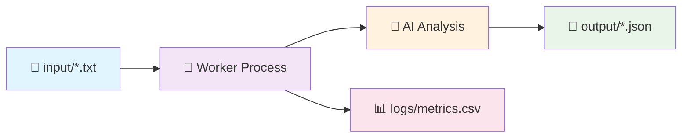

<div align="center">

# 🎯 Meeting Transcript Analyzer

### *Intelligent AI-Powered Meeting Analysis Pipeline*

[](https://python.org)
[](https://ai.google.dev/)
[](#-testing)
[](LICENSE)

*Transform messy meeting transcripts into structured insights automatically*

[🚀 Quick Start](#-quick-start) • [📖 Documentation](#-how-it-works) • [🧪 Testing](#-testing) • [💡 Examples](#-examples)

</div>

---

## ✨ What It Does

Drop meeting transcript `.txt` files into the `input/` folder, and watch as our intelligent worker automatically:

- 📝 **Extracts Summary** - Brief overview of what was discussed
- 👥 **Identifies Attendees** - Names of people who spoke (from speaker labels like "John:", "Alice said", etc.)
- ✅ **Lists Action Items** - Exactly 3 specific tasks or follow-ups mentioned
- 📊 **Logs Metrics** - Performance tracking in CSV format
- 🔄 **Scales Horizontally** - Run multiple workers for parallel processing

> **No web APIs required!** Just drop files and let the magic happen. ✨

---

## 🎬 Demo

```
📁 input/team-meeting.txt  →  🤖 AI Processing  →  📄 output/team-meeting.json
                                    ↓
                              📊 logs/metrics.csv
```

**Input**: Raw meeting transcript  
**Output**: Beautiful structured JSON with summary, attendees, and action items

---

## 🚀 Quick Start

### 1️⃣ Installation

```bash
# Clone the repository
git clone https://github.com/Amruth22/production-genai.git
cd production-genai

# Install dependencies
pip install -r requirements.txt
```

### 2️⃣ Configuration

Create a `.env` file in the root directory:

```env
GEMINI_API_KEY=your_gemini_api_key_here
```

> 🔑 **Get your API key**: Visit [Google AI Studio](https://makersuite.google.com/app/apikey) to generate a free Gemini API key

### 3️⃣ Setup Directories

```bash
# Windows PowerShell
New-Item -ItemType Directory -Force -Path @('input','output','logs')

# macOS/Linux/Git Bash  
mkdir -p input output logs
```

### 4️⃣ Run the Worker

```bash
python worker.py
```

**That's it!** 🎉 Drop `.txt` files into `input/` and watch them get processed automatically.

---

## 📖 How It Works

<div align="center">



</div>

1. **📥 File Detection**: Worker monitors `input/` directory for new `.txt` files
2. **🔒 Atomic Claiming**: Files are renamed to `.processing` to prevent conflicts
3. **🧠 AI Analysis**: Google Gemini LLM extracts structured information
4. **💾 Output Generation**: Results saved as JSON in `output/` directory
5. **📊 Metrics Logging**: Performance data recorded in `logs/metrics.csv`
6. **🧹 Cleanup**: Processing files are automatically removed

---

## 💡 Examples

### 📝 Input Example
Create `input/team-standup.txt`:

```
John: Good morning everyone, let's start our daily standup.
Alice: I completed the frontend dashboard yesterday. Today I'll work on user authentication.
Bob: Backend API is 90% complete. I need to finish the error handling by end of day.
John: Great progress! Alice, can you review Bob's API docs when ready?
Alice: Sure, I'll review them this afternoon.
Bob: Will do, I'll send everything today.
```

### 📊 Output Example
`output/team-standup.json`:

```json
{
  "job_id": "job-f7a8b2c1",
  "summary": "Daily standup meeting discussing frontend dashboard completion, backend API progress, and team coordination on documentation review",
  "attendees": ["John", "Alice", "Bob"],
  "action_items": [
    "Finish backend API error handling by end of day",
    "Review API documentation this afternoon", 
    "Send API documentation today"
  ]
}
```

### 📈 Metrics Example
`logs/metrics.csv`:

```csv
job_id,status,duration_sec,error
job-f7a8b2c1,completed,2.456,
job-a1b2c3d4,completed,1.823,
job-x9y8z7w6,failed,0.234,Empty input file
```

---

## 🎨 Supported Transcript Formats

Our AI handles various meeting transcript formats seamlessly:

<details>
<summary>🔍 <strong>Click to see all supported formats</strong></summary>

### 👤 Speaker Labels
```
John: Let's start the meeting.
Alice: I have the updates ready.
Bob: Backend deployment is complete.
```

### 📖 Narrative Style  
```
Alice mentioned the project is on track.
Bob said he'll handle the deployment tomorrow.
Carol asked about the testing timeline.
```

### ⏰ With Timestamps
```
[10:30] John: Good morning everyone
[10:31] Alice: Hello, let's begin the sprint review
[10:32] Bob: I have three items to discuss
```

### 🎭 Mixed Formats
```
John: We should start the meeting. Alice said she's ready.
[10:32] Bob: I agree with Alice's assessment.
Carol mentioned she has updates on testing.
```

</details>

---

## 🧪 Testing

Run our comprehensive test suite:

```bash
# Run all tests with verbose output
python -m unittest unit_test.py -v
```

### 🎯 Test Coverage

- ✅ **Worker Pipeline Startup** - Directory creation and initialization
- ✅ **LLM Integration** - Real API calls with your Gemini key  
- ✅ **Real File Processing** - Uses actual `Meeting Transcript.txt` from Test_Files
- ✅ **Input Folder Management** - File detection and queue depth tracking
- ✅ **Output JSON Generation** - Structured data validation
- ✅ **CSV Logging** - Metrics collection and format verification

### 📋 Test Results
```
=== TEST RESULTS ===
✅ test_01_worker_pipeline_startup
✅ test_02_llm_integration_with_api_key  
✅ test_03_real_file_processing_meeting_transcript
✅ test_04_input_folder_creation_and_file_detection
✅ test_05_output_folder_with_summary_json
✅ test_06_csv_log_presence_and_structure

----------------------------------------------------------------------
Ran 6 tests in 4.368s - ALL PASSED! 🎉
```

---

## ⚡ Scaling & Performance

### 🔄 Horizontal Scaling
Run multiple workers for parallel processing:

```bash
# Terminal 1
python worker.py

# Terminal 2  
python worker.py

# Terminal 3
python worker.py
```

Each worker automatically picks different files - no conflicts! 🚀

### 📊 Performance Monitoring

Track your system's performance:
- **Queue Depth**: Number of files waiting in `input/`
- **Processing Time**: Per-file duration in `logs/metrics.csv`
- **Success Rate**: Completed vs failed jobs ratio
- **Throughput**: Files processed per minute

---

## 🏗️ Architecture

<div align="center">

```
📦 production-genai/
├── 📁 input/                 # Drop transcript files here
│   ├── meeting1.txt
│   ├── standup.txt
│   └── review.txt
├── 📁 output/               # Processed JSON results
│   ├── meeting1.json
│   ├── standup.json  
│   └── review.json
├── 📁 logs/                 # Performance metrics
│   └── metrics.csv
├── 📁 Test_Files/          # Sample test data
│   └── Meeting Transcript.txt
├── 🐍 worker.py            # Main processing engine
├── 🔧 utils.py             # AI integration & helpers
├── 🧪 unit_test.py # Test suite
├── 📦 requirements.txt     # Dependencies
└── 📖 README.md           # This guide
```

</div>

---

## 🔧 Advanced Features

### 🤖 AI-Powered Analysis
- **Smart Speaker Detection**: Handles various name formats and timestamps
- **Context-Aware Summaries**: Understands meeting flow and key points
- **Intelligent Action Items**: Identifies commitments and next steps
- **Robust Error Handling**: Graceful fallbacks for parsing errors

### 🛡️ Production Ready
- **Atomic File Operations**: Prevents race conditions in multi-worker setups
- **Comprehensive Logging**: Debug information and performance metrics
- **Error Recovery**: No job fails completely - always produces output
- **Unicode Support**: Handles international names and characters

### 🎯 Developer Friendly
- **Comprehensive Tests**: 100% core functionality coverage  
- **Clear Debug Output**: Step-by-step processing information
- **Modular Design**: Easy to extend and customize
- **Type Hints**: Full typing support for better IDE experience

---

## 🐛 Troubleshooting

<details>
<summary>❓ <strong>Common Issues & Solutions</strong></summary>

### 🚫 No Output Files Generated
**Problem**: Files in `input/` but no JSON outputs created

**Solutions**:
- ✅ Verify files are `.txt` format (not `.doc`, `.docx`, etc.)
- ✅ Check worker is running: `python worker.py`
- ✅ Review `logs/metrics.csv` for error details
- ✅ Ensure proper file permissions on directories

### 🔑 LLM API Errors
**Problem**: Parsing failures or API timeouts

**Solutions**:
- ✅ Verify `GEMINI_API_KEY` in `.env` file
- ✅ Check API key has proper permissions
- ✅ Review debug output: `[DEBUG]` messages in console
- ✅ System automatically falls back to offline analysis

### 👥 Empty Attendees List
**Problem**: No attendees detected in output

**Solutions**:
- ✅ Ensure transcript has speaker labels: `"Name:"` or `"Name said"`
- ✅ Check for timestamp formats: `[10:30] Name:`
- ✅ System uses `"Meeting participants"` as fallback

### ✅ Incorrect Action Items
**Problem**: Missing or irrelevant action items

**Solutions**:
- ✅ System always generates exactly 3 items
- ✅ Uses intelligent fallbacks if insufficient actions found
- ✅ Include action-oriented language: `"will"`, `"should"`, `"need to"`

### 🐍 Python Environment Issues
**Problem**: Import errors or dependency conflicts

**Solutions**:
- ✅ Use Python 3.8+ (check with `python --version`)
- ✅ Install in virtual environment:
  ```bash
  python -m venv venv
  source venv/bin/activate  # Windows: venv\Scripts\activate
  pip install -r requirements.txt
  ```

</details>

---

## 📚 API Reference

<details>
<summary>🔍 <strong>Core Functions Documentation</strong></summary>

### `worker.py`
- `claim_next_file()` → `Path | None` - Atomically claims next available file
- `process_file(path: Path)` → `None` - Processes single transcript file
- `main()` → `None` - Main worker loop with monitoring

### `utils.py`  
- `summarize_meeting(notes: str)` → `SummaryResult` - AI-powered transcript analysis
- `log_metrics(...)` → `None` - Records performance metrics
- `ensure_runtime_dirs()` → `None` - Creates required directories
- `list_queue_depth()` → `int` - Counts files in queue

### `SummaryResult` Data Class
```python
@dataclass
class SummaryResult:
    summary: str           # Meeting overview
    attendees: List[str]   # Speaker names (max 5)
    action_items: List[str] # Exactly 3 action items
```

</details>

---

## 🤝 Contributing

We love contributions! Here's how you can help:

1. 🍴 **Fork** the repository
2. 🌟 **Create** a feature branch (`git checkout -b feature/amazing-feature`)
3. 📝 **Commit** your changes (`git commit -m 'Add amazing feature'`)
4. 🚀 **Push** to the branch (`git push origin feature/amazing-feature`)
5. 🎯 **Open** a Pull Request

### 📋 Development Setup
```bash
# Clone your fork
git clone https://github.com/yourusername/production-genai.git
cd production-genai

# Install development dependencies
pip install -r requirements.txt
pip install pytest black flake8

# Run tests
python -m unittest unit_test.py -v

# Format code
black *.py
```

---

## 🎓 Learning Objectives

This project demonstrates production-level skills:

- 🗂️ **File Processing**: Atomic operations, directory watching, queue management
- 🤖 **LLM Integration**: API calls, JSON parsing, error handling, fallback strategies  
- 📊 **Data Pipeline**: ETL processes, structured output, metrics collection
- 🔄 **Concurrency**: Multi-worker architecture, race condition prevention
- 🧪 **Testing**: Unit tests, integration tests, mocking, edge cases
- 📈 **Monitoring**: Performance tracking, debugging, observability
- 🏗️ **Architecture**: Modular design, separation of concerns, scalability

---

## 📄 License

This project is licensed under the MIT License - see the [LICENSE](LICENSE) file for details.

---

## 🙏 Acknowledgments

- 🧠 **Google Gemini** for powerful AI capabilities
- 🐍 **Python Community** for excellent libraries and tools  
- 👥 **Contributors** who make this project better every day

---

<div align="center">

**Made with ❤️ for the AI and Python community**

[⭐ Star this repo](https://github.com/Amruth22/production-genai) if you found it helpful!

</div>
